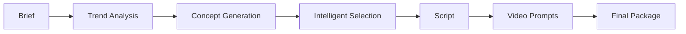

# 🎬 YouTube AI Automation System

[](https://www.python.org/downloads/)
[](https://opensource.org/licenses/MIT)
[](https://openai.com/)
[](https://docs.pydantic.dev/)

A sophisticated, structured-generation engine designed to automate the entire YouTube content creation lifecycle. From trend analysis to final concept packaging, this system leverages LLMs to turn raw data into viral-ready video blueprints.

---

## 🚀 The Pipeline

Our orchestration layer runs through production stages and outputs a final package:



1. **Brief**: Input your channel identity and goals.
2. **Trend**: Structured analysis of winning/declining patterns.
3. **Concept**: Batch generation of 5 video concepts with titles, hooks, and predictions.
4. **Selector**: Weighted selection of one winning concept with scoring breakdown.
5. **Script**: Retention-aware structured script with segments, hooks, and CTA.
6. **Video Prompts**: AI-ready cinematic prompts generated from script segments.
7. **Final Package**: Combined output with all artifacts.

**Next Stage**: AI video generation using the structured prompts (Kling, Runway, etc.).

---

## ✨ Key Features

- **🎯 Structured Generation**: Deeply typed Pydantic models ensure schema-perfect LLM outputs every time.
- **⚖️ Deterministic Selection**: Machine-readable scoring logic for selecting the best-performing video concepts.
- **🎬 AI Video Ready**: Generates cinematic prompts ready for text-to-video models (Kling, Runway, etc.).
- **📂 Artifact Persistence**: Comprehensive logging of raw, parsed, and validated outputs for observability.
- **🔌 Pluggable Architecture**: Modular design allows easy swapping of LLM providers or generator logic.
- **🧪 Mock Mode**: Development-friendly mock mode to test pipeline logic without burning API credits.
- **📜 Schema Export**: One-click JSON schema generation for seamless GUI or service integration.
- **🔄 Fallback Generation**: Deterministic mock outputs match schemas when LLM is unavailable.

---

## 🛠️ Quick Start

### 1. Installation

```bash
# Clone the repository
git clone https://github.com/YOUR_USERNAME/youtube-ai-system.git
cd youtube-ai-system

# Create and activate virtual environment
python -m venv .venv
source .venv/bin/activate

# Install in editable mode
pip install -e .
```

### 2. Configuration

Set up your environment variables:

```bash
cp .env.example .env
```

Edit `.env` with your settings:

**Mock Mode** (default - no API key needed):
```env
LLM_MODE=mock
```

**OpenAI Mode** (requires API key):
```env
LLM_MODE=openai
LLM_MODEL=gpt-4o
OPENAI_API_KEY=sk-...
```

**Required Environment Variables**:
- `LLM_MODE`: `mock` or `openai`
- `OPENAI_API_KEY`: Your OpenAI API key (required when `LLM_MODE=openai`)
- `OUTPUT_ROOT`: Output directory path (default: `outputs`)

### 3. Run the Pipeline

**Mock Mode** (deterministic fallback, no API costs):
```bash
python -m app.main run --brief examples/channel_brief.json --project my_first_video
```

**OpenAI Mode** (requires `OPENAI_API_KEY`):
```bash
export LLM_MODE=openai
export OPENAI_API_KEY=sk-...
python -m app.main run --brief examples/channel_brief.json --project my_first_video
```

**Full Pipeline Test** (all stages through shot plan):
```bash
python -m pytest tests/test_shot_plan.py -v
```

Primary outputs written to `outputs/<project>/`:

| File | Description |
|------|-------------|
| `01_trend.json` | Trend analysis report |
| `02_concepts.json` | Generated concept batch (5 concepts) |
| `03_selected_concept.json` | Winning concept with score breakdown |
| `04_script.json` | Structured script with segments, hooks, CTA |
| `05_video_prompts.json` | AI-ready cinematic video prompts |
| `final_package.json` | Combined output with all artifacts |

LLM stage artifacts are written under `_artifacts/<stage>/` with raw, parsed, and validated snapshots.

---

## 📂 Project Structure

```text
├── app/
│   ├── schemas/        # Pydantic models & JSON schemas
│   ├── modules/        # Pipeline stage engines (script, voice, storyboard, shot planner)
│   ├── llm/            # LLM client implementations
│   ├── prompts/        # Prompt templates
│   ├── utils/          # Validator, artifact store, I/O utilities
│   ├── orchestrator.py # Core pipeline logic
│   └── main.py         # CLI Entrypoint
├── examples/           # Sample channel briefs
├── outputs/            # Generated artifacts (gitignored)
└── tests/              # Unit and integration tests
```

---

## 🛠️ Technology Stack

-   **Core**: [Python 3.10+](https://python.org)
-   **CLI**: [Typer](https://typer.tiangolo.com/) & [Rich](https://rich.readthedocs.io/)
-   **Validation**: [Pydantic v2](https://docs.pydantic.dev/)
-   **AI**: [OpenAI API](https://openai.com/)

---

## 🤝 Contributing

Contributions are welcome! If you're interested in improving existing generators (Script, Voiceover, Thumbnail, Kling API), please open an issue or submit a PR.

---

## 📄 License

This project is licensed under the MIT License - see the [LICENSE](LICENSE) file for details.

---

<p align="center">
  Built with ❤️ for YouTube Creators
</p>
