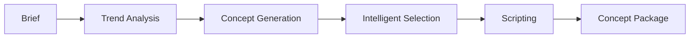

# 🎬 YouTube AI Automation System

[](https://www.python.org/downloads/)
[](https://opensource.org/licenses/MIT)
[](https://openai.com/)
[](https://docs.pydantic.dev/)

A sophisticated, structured-generation engine designed to automate the entire YouTube content creation lifecycle. From trend analysis to final concept packaging, this system leverages LLMs to turn raw data into viral-ready video blueprints.

---

## 🚀 The Pipeline

Our intelligent orchestration layer flows seamlessly through five critical stages:



1.  **Brief**: Input your channel identity and goals.
2.  **Trend**: Real-time analysis of market trends.
3.  **Concept**: Batch generation of creative video ideas.
4.  **Selector**: Weighted, score-based selection of the strongest concept.
5.  **Script**: Detailed scripting optimized for audience retention.
6.  **Package**: Complete metadata and artifact bundle for production.

---

## ✨ Key Features

-   **🎯 Structured Generation**: Deeply typed Pydantic models ensure schema-perfect LLM outputs every time.
-   **⚖️ Deterministic Selection**: Machine-readable scoring logic for selecting the best-performing video concepts.
-   **📂 Artifact Persistence**: Comprehensive logging of raw, parsed, and validated outputs for observability.
-   **🔌 Pluggable Architecture**: Modular design allows easy swapping of LLM providers or generator logic.
-   **🧪 Mock Mode**: Development-friendly mock mode to test pipeline logic without burning API credits.
-   **📜 Schema Export**: One-click JSON schema generation for seamless GUI or service integration.

---

## 🛠️ Quick Start

### 1. Installation

```bash
# Clone the repository
git clone https://github.com/YOUR_USERNAME/youtube-ai-system.git
cd youtube-ai-system

# Create and activate virtual environment
python -m venv .venv
source .venv/bin/activate

# Install in editable mode
pip install -e .
```

### 2. Configuration

Set up your environment variables:

```bash
cp .env.example .env
```

Edit `.env` with your OpenAI API key and desired settings:
```env
LLM_MODE=openai
LLM_MODEL=gpt-4o  # Recommended for best results
OPENAI_API_KEY=sk-...
```

### 3. Run the Pipeline

```bash
python -m app.main run --brief examples/channel_brief.json --project my_first_video
```

---

## 📂 Project Structure

```text
├── app/
│   ├── schemas/        # Pydantic models & JSON schemas
│   ├── generators/     # LLM-specific generation logic
│   ├── orchestrator.py # Core pipeline logic
│   └── main.py         # CLI Entrypoint
├── examples/           # Sample channel briefs
├── outputs/            # Generated artifacts (gitignored)
└── tests/              # Unit and integration tests
```

---

## 🛠️ Technology Stack

-   **Core**: [Python 3.10+](https://python.org)
-   **CLI**: [Typer](https://typer.tiangolo.com/) & [Rich](https://rich.readthedocs.io/)
-   **Validation**: [Pydantic v2](https://docs.pydantic.dev/)
-   **AI**: [OpenAI API](https://openai.com/)

---

## 🤝 Contributing

Contributions are welcome! If you're interested in adding new generators (Voiceover, Thumbnail, Kling API), please open an issue or feel free to submit a PR.

---

## 📄 License

This project is licensed under the MIT License - see the [LICENSE](LICENSE) file for details.

---

<p align="center">
  Built with ❤️ for YouTube Creators
</p>
